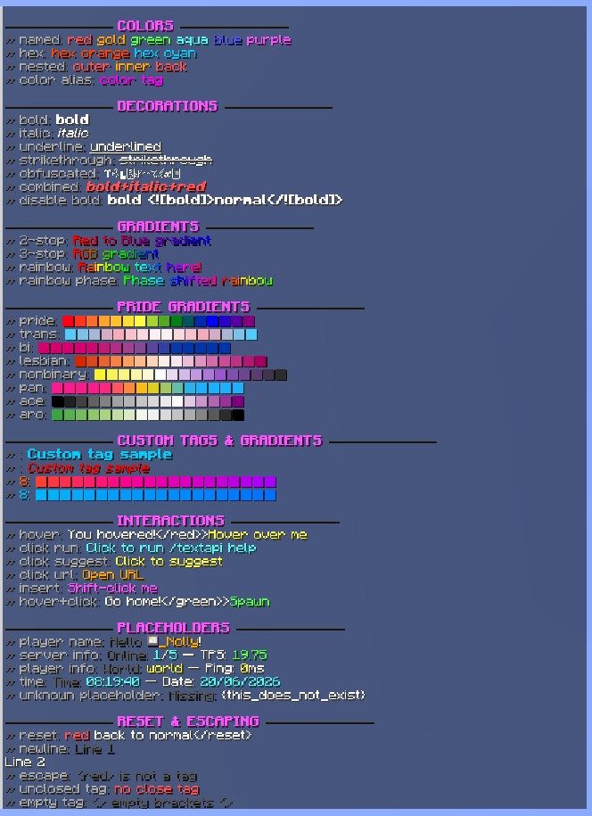

# TextAPI


TextAPI is a high-performance text formatting and parsing system for Spigot 1.21+ servers.

It provides a MiniMessage-like syntax with placeholders, colors, gradients, rainbow effects, hover/click events, runtime tag and gradient registration with full handler control, and a fully extensible API.

---



## Features

* Custom tag-based parser
* Placeholder system
* Runtime placeholder registration/unregistration
* Runtime tag registration with full style handler control
* Runtime gradient registration with custom color stops
* Click and hover events
* Insertion events
* Gradient rendering (2+ color stops)
* Rainbow rendering with phase support
* Pride gradient presets (14 built-in)
* Token-level parser API
* Legacy string output
* Component output
* Full debug command suite with live test runner
* TPS placeholder support
* Tab-complete enabled `/textapi` command

---

## Installation

### Build

```bash
mvn clean package
```

### Install

Place the generated jar inside:

```text
/plugins/TextAPI-1.0.4.jar
```

Restart the server.

---

## Using TextAPI

TextAPI can be consumed through:

* Local Maven install
* GitHub Packages

---

## Option 1 — Local Install

Build and install locally:

```bash
mvn clean install
```

Dependency:

```xml
<dependency>
    <groupId>com.nolly.mc</groupId>
    <artifactId>textapi</artifactId>
    <version>1.0.4</version>
    <scope>provided</scope>
</dependency>
```

---

## Option 2 — GitHub Packages

### Repository

```xml
<repositories>
    <repository>
        <id>github</id>
        <url>https://maven.pkg.github.com/thenolle/textapi</url>
    </repository>
</repositories>
```

### Dependency

```xml
<dependency>
    <groupId>com.nolly.mc</groupId>
    <artifactId>textapi</artifactId>
    <version>1.0.4</version>
    <scope>provided</scope>
</dependency>
```

### Authentication

`~/.m2/settings.xml`

```xml
<settings xmlns="http://maven.apache.org/SETTINGS/1.0.0"
          xmlns:xsi="http://www.w3.org/2001/XMLSchema-instance"
          xsi:schemaLocation="http://maven.apache.org/SETTINGS/1.0.0
                              http://maven.apache.org/xsd/settings-1.0.0.xsd">

    <activeProfiles>
        <activeProfile>github</activeProfile>
    </activeProfiles>

    <profiles>
        <profile>
            <id>github</id>

            <repositories>
                <repository>
                    <id>central</id>
                    <url>https://repo.maven.apache.org/maven2</url>
                </repository>

                <repository>
                    <id>github</id>
                    <url>https://maven.pkg.github.com/thenolle/textapi</url>

                    <snapshots>
                        <enabled>true</enabled>
                    </snapshots>
                </repository>
            </repositories>
        </profile>
    </profiles>

    <servers>
        <server>
            <id>github</id>
            <username>YOUR_GITHUB_USERNAME</username>
            <password>YOUR_GITHUB_TOKEN</password>
        </server>
    </servers>

</settings>
```

---

## Gradle (Groovy)

```gradle
repositories {
    maven {
        url = uri("https://maven.pkg.github.com/thenolle/textapi")

        credentials {
            username = System.getenv("GITHUB_ACTOR")
            password = System.getenv("GITHUB_TOKEN")
        }
    }
}

dependencies {
    compileOnly 'com.nolly.mc:textapi:1.0.4'
}
```

---

## Gradle (Kotlin)

```kts
repositories {
    maven {
        url = uri("https://maven.pkg.github.com/thenolle/textapi")

        credentials {
            username = System.getenv("GITHUB_ACTOR")
            password = System.getenv("GITHUB_TOKEN")
        }
    }
}

dependencies {
    compileOnly("com.nolly.mc:textapi:1.0.4")
}
```

---

## Configuration

```yml
command:
  enabled: true
```

---

## Commands

### Main Command

```text
/textapi
```

### Subcommands

```text
/textapi parse <message>
/textapi preview <message>
/textapi components <message>
/textapi tokens <message>
/textapi test
/textapi examples
/textapi placeholders
/textapi tags
/textapi gradients
/textapi register placeholder <key> <value>
/textapi register tag <name> <#hex|colorname> [bold] [italic] [underline] [strikethrough] [obfuscated]
/textapi register gradient <name> <#hex1> <#hex2> [#hex3 ...]
/textapi unregister placeholder <key>
/textapi unregister tag <name>
/textapi unregister gradient <name>
```

### Command Reference

| Subcommand | Description |
|---|---|
| `parse <msg>` | Render and send a message |
| `preview <msg>` | Show raw input, parsed string, and live render side by side |
| `components <msg>` | Dump each component with color and decoration flags |
| `tokens <msg>` | Dump the token list produced by the parser |
| `test` | Run a full in-game feature test covering every system (player only) |
| `examples` | Print quick usage examples |
| `placeholders` | List all registered placeholder keys |
| `tags` | List all registered custom tags |
| `gradients` | List all registered custom gradients with a live preview bar |
| `register placeholder` | Register a static placeholder at runtime |
| `register tag` | Register a custom tag with color and decoration flags |
| `register gradient` | Register a named gradient with 2+ hex color stops |
| `unregister placeholder` | Remove a registered placeholder |
| `unregister tag` | Remove a registered custom tag |
| `unregister gradient` | Remove a registered custom gradient |

---

## Syntax Guide

### Colors

```txt
<red>Red</red>
<gold>Gold</gold>
<green>Green</green>
<#ff5500>Hex Color</#ff5500>
<color:#aa00ff>Color Alias</color>
```

### Gradients

```txt
<gradient:#ff0000:#00ff00>Two Stop</gradient>
<gradient:#ff0000:#ffff00:#00ff00>Three Stop</gradient>
```

### Rainbow

```txt
<rainbow>Rainbow Text</rainbow>
<rainbow:120>Phase Shifted Rainbow</rainbow>
```

### Decorations

```txt
<bold>Bold</bold>
<italic>Italic</italic>
<underlined>Underline</underlined>
<strikethrough>Strike</strikethrough>
<obfuscated>Magic</obfuscated>
```

### Disable Decorations

```txt
<bold>
    Bold
    <!bold>Not Bold</!bold>
    Bold Again
</bold>
```

### Hover Events

```txt
<hover:show_text:Hello World>Hover Me</hover>
<hover:show_text:<red>Danger!</red>>Hover Me</hover>
```

### Click Events

```txt
<click:run_command:/spawn>Run Command</click>
<click:suggest_command:/msg >Suggest Command</click>
<click:open_url:https://example.com>Open URL</click>
<click:copy_to_clipboard:Copied Text>Copy</click>
```

### Insertions

```txt
<insert:Hidden Text>Shift-Click Me</insert>
```

### Combined Events

```txt
<hover:show_text:<green>Go home!</green>><click:run_command:/spawn>Spawn</click></hover>
```

### Reset

```txt
<red>Red <reset>Back to default</reset>
```

### Escaping

```txt
\<red\> is not parsed as a tag
```

### Placeholders

```txt
Hello {player}
Online: {server_online}
TPS: {server_tps}
```

---

## Pride Gradients

```txt
<pride>Pride</pride>
<trans>Trans</trans>
<bi>Bisexual</bi>
<lesbian>Lesbian</lesbian>
<nonbinary>Nonbinary</nonbinary>
<pan>Pansexual</pan>
<ace>Asexual</ace>
<aro>Aromantic</aro>
<genderfluid>Genderfluid</genderfluid>
<agender>Agender</agender>
<intersex>Intersex</intersex>
<polyam>Polyamorous</polyam>
<demi>Demisexual</demi>
<genderqueer>Genderqueer</genderqueer>
```

---

## Built-in Placeholders

### Player

* `{player}`
* `{player_name}`
* `{player_uuid}`
* `{player_display}`
* `{player_world}`
* `{player_x}`
* `{player_y}`
* `{player_z}`
* `{player_ping}`
* `{player_gamemode}`
* `{player_health}`
* `{player_food}`
* `{player_level}`
* `{player_exp}`
* `{player_ip}`
* `{player_locale}`
* `{player_online}`

### Server

* `{server_name}`
* `{server_version}`
* `{server_motd}`
* `{server_online}`
* `{server_max}`
* `{server_tps}`

### Time

* `{time}`
* `{date}`
* `{datetime}`
* `{timestamp}`

### Misc

* `{newline}`
* `{prefix}`

---

## API Usage

### Parsing

```kt
val text = TextAPI.parse("<red>Hello {player}</red>", player)
```

### Components

```kt
val components = TextAPI.components("<bold>Hello</bold>", player)
```

### Sending Messages

```kt
TextAPI.send(player, "<gradient:#ff0000:#00ff00>Hello</gradient>")
```

### Tokens

```kt
val tokens = TextAPI.tokens("<red>Hello</red>")
```

---

## Placeholder Registration

### Register

```kt
TextAPI.registerPlaceholder("rank") { player ->
    if (player?.isOp == true) "Admin" else "User"
}
```

Usage:

```txt
Hello {rank}
```

### Unregister

```kt
TextAPI.unregisterPlaceholder("rank")
```

### List (API)

```kt
val keys: Set<String> = TextAPI.registeredPlaceholders()
```

---

## Tag Registration

Tags are registered with a `TagHandler` that receives the current `TextStyle` and optional tag arguments, and returns the modified `TextStyle` to apply.

### Register — simple color

```kt
TextAPI.registerTag("vip") { style, _ ->
    style.copy(color = ChatColor.of("#ffd700"), bold = true)
}
```

### Register — color + decorations

```kt
TextAPI.registerTag("danger") { style, _ ->
    style.copy(color = ChatColor.RED, bold = true, italic = true)
}
```

### Register — argument-aware

```kt
// Usage: <highlight:#ff4400>text</highlight>
TextAPI.registerTag("highlight") { style, args ->
    val color = args?.let { TextTag.resolveColor(it) }
    style.copy(color = color, underlined = true)
}
```

Usage:

```txt
<vip>VIP Player</vip>
<danger>Warning!</danger>
<highlight:#ff4400>Highlighted</highlight>
```

### Unregister

```kt
TextAPI.unregisterTag("vip")
```

### List (API)

```kt
val tags: Set<String> = TextAPI.registeredTags()
```

### Register via command

```text
/textapi register tag vip #ffd700 bold
/textapi register tag danger red bold italic
```

> The command supports color + decoration flags only. For argument-aware tags, register from code.

---

## Gradient Registration

Named gradients behave exactly like built-in pride gradients and the `<gradient>` tag — they expand per character with smooth color interpolation.

### Register

```kt
TextAPI.registerGradient("sunset", listOf("#ff6600", "#ff0099", "#aa00ff"))
TextAPI.registerGradient("ocean",  listOf("#00c6ff", "#0072ff"))
TextAPI.registerGradient("fire",   listOf("#ff0000", "#ff6600", "#ffff00"))
```

Usage:

```txt
<sunset>Hello sunset world</sunset>
<ocean>Deep ocean text</ocean>
```

### Unregister

```kt
TextAPI.unregisterGradient("sunset")
```

### List (API)

```kt
val gradients: Set<String> = TextAPI.registeredGradient()
```

### Register via command

```text
/textapi register gradient sunset #ff6600 #ff0099 #aa00ff
/textapi register gradient ocean #00c6ff #0072ff
```

> Minimum 2 stops. The command also renders an immediate preview bar on registration.

---

## Performance Notes

* Single-pass tokenization
* Linear parsing complexity
* Linear gradient expansion
* Linear rainbow expansion
* Cached placeholder resolution per render context
* Rolling TPS history buffer
* No reflection
* Minimal allocations during rendering

---

## Permissions

```text
com.nolly.mc.textapi.command
```

Default:

```text
op
```

---

## Compatibility

* Spigot 1.21+
* Java 21+
* Kotlin 2.4+
* Bungee Chat Component API

---

## License

<a href="http://www.wtfpl.net/">

</a>
